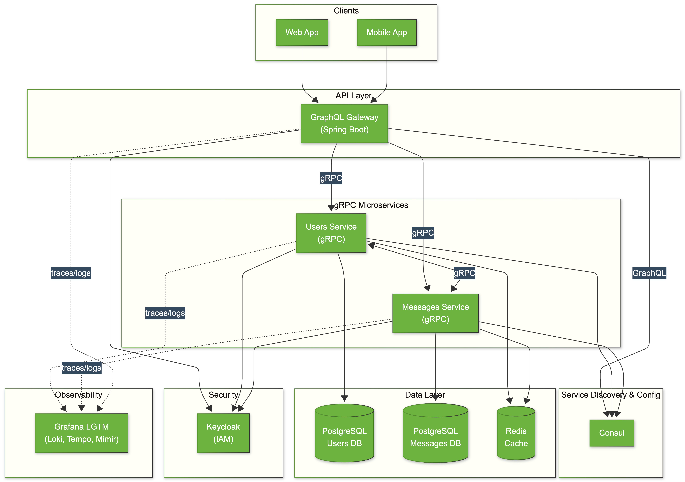

# Introducing SBCGG: A Cloud-Native Microservices Platform Built from Real-World Experience

Today I'm starting a series of posts about my open-source project called **SBCGG** (Spring Boot Cloud GraphQL gRPC).

**GitHub**: https://github.com/jpbassinello/spring-boot-cloud-graphql-grpc

---

## Why I Built This

As developers, we know the value of active communities. Giving something back has always been part of my career plans, and this project was built with that mindset.

Throughout my career as a backend developer, I've worked for multiple companies across different industries, mostly in the JVM ecosystem. I've seen it all: from monoliths running heavy JSF stateful platforms to modern cloud-native microservices. Each project taught me something new, and over time, I accumulated a lot of knowledge that I wanted to consolidate somewhere.

So I decided to build a single project that would serve two purposes: **consolidate my learnings** and **be reusable for my own side projects**.

## Starting with a Real Use Case

The first step was defining a realistic use case. I wanted something simple but practical, something that developers encounter in almost every application.

I chose: **a user signs up for an app and receives a message with an authorization code to validate and enable their account**.

Simple, right? But it touches on authentication, messaging, service communication, and data persistence, which are the building blocks of most systems.

## The Evolution

With the use case defined, I started designing the system. As a Spring enthusiast, everything was built on top of **Spring Boot**. The initial versions were pretty basic, with no clean architecture standards and no microservices infrastructure.

But the project kept evolving:

- **Maven to Gradle**: I had never used Gradle in a production project, so I switched to learn it hands-on.
- **Monolith to Microservices**: I split the application into two services, one for user management and another for messaging.
- **REST to gRPC**: For inter-service communication, I replaced REST with gRPC.
- **GraphQL Gateway**: The API gateway now exposes a GraphQL interface to clients.

Here's what the current architecture looks like:

## Why GraphQL + gRPC?

These two technologies are game changers. Many large-scale companies have adopted them for their core systems:

- **Netflix**: Uses gRPC for internal service communication, GraphQL for data delivery, and Spring Boot as its core Java framework.
- **Uber**: Uses gRPC for real-time location tracking and backend services.
- **Spotify**: Employs gRPC for high-performance service communication.
- **Airbnb**: Uses both gRPC and GraphQL to power their platforms.
- **Square**: Implements gRPC for payment processing.
- **Shopify**: Leverages GraphQL for its backend services.
- **TikTok**: Utilizes gRPC for recommendation engine services.

The combination makes sense: **gRPC** for fast, low-latency inter-service communication, and **GraphQL** for flexible API consumption by client applications.

## Getting It Ready to Share

After years of iterations, I felt the project was in good shape technically, but still too messy to share publicly. The documentation was scattered, the structure needed cleanup, and explaining everything felt overwhelming.

Then came the AI era. Tools like Claude made it much easier to organize documentation and structure the codebase for public consumption. That boost in productivity was the final push I needed to start writing posts and share this project with the community.

## What's Next?

If you're interested, I invite you to explore the project on GitHub. I'm planning more posts diving into specific parts of the architecture:

- **Why GraphQL API resolvers integrated with gRPC microservices are so powerful**
- **How Spring Boot 4 simplified observability** and why metrics and traces are essential in microservices
- **Hexagonal Architecture in production microservices projects**

---

I'd love to hear your feedback. If you think this could help other developers, please share it.

**GitHub**: https://github.com/jpbassinello/spring-boot-cloud-graphql-grpc

Thank you for reading.